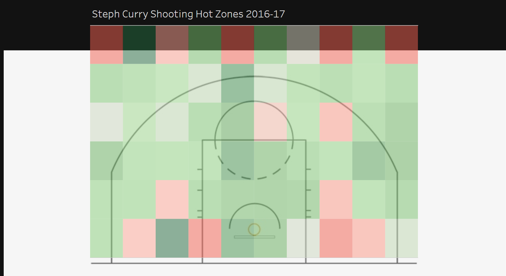

# **Michael Nappi**

Welcome to my design portfolio for *CS-130 and CS-257*. 
This site brings together the major projects, prototypes, analyses, and reflections I’ve created throughout the semester. 
Each project demonstrates how I applied human-centered design principles, iteration, critique, and usability testing to arrive at effective design solutions.

---

## **Design Manifesto**

Read my full **[Design Manifesto](manifesto.md)**, where I outline my personal philosophy of design based on evidence from my semester-long work, including what I learned about iteration, expectations vs. reality, user testing, and the challenges of design.

---

## UX Design Projects

### Buffalo Zoo App

**Project Type:** Mobile UX Design  
**Tools:** Figma  

This project focused on designing a mobile app experience for parents who want to be visitors for the Buffalo Zoo. The goal was to improve planning, and overall visitor engagement during a zoo visit, while providing entertaining pages for the kids.

**Key UX Focus Areas:**
- Simplifying navigation and information
- Balancing informational and entertaining pages on the website
- Creating a clear, friendly interface suitable for a wide age range

**[View Figma Prototype](https://www.figma.com/design/pnvTYex16bkdXRIZHD5ULB/Buffalo-Zoo-App)**

**[View Design Document](https://bonaventureedu-my.sharepoint.com/:w:/g/personal/nappimd24_bonaventure_edu/IQD3L3GzMHWiTp4tlh7cUihCAYbXi-Vm3rnFjQi5N3NqfFA?e=uf8wBP)**

---

### WSBU Prototype

**Project Type:** Web UX Design
**Tools:** Figma  

This project involved redesigning/conceptualizing a digital experience for WSBU, our campus radio station. The focus was on usability and supporting multiple user needs, including listeners and station DJs. The purpose of the project was to provide a layout that could be implemented in the final product.

**Key UX Focus Areas:**
- Providing information for media content
- Clear navigation for different users
- Visual readability

**[View Figma Prototype](https://www.figma.com/design/L3tVzrUe0DaY3lwohn8arT/WSBU-Prototype)**

**[View Design Document](https://bonaventureedu-my.sharepoint.com/:w:/g/personal/nappimd24_bonaventure_edu/IQAE2aywwH7BSahP65j5e60DAY56qgFLcURuHbgr50CDLFQ?e=mcRGce)**

---

## UX-Focused Data Visualization

### NBA Shots Heat Chart

**Project Type:** Data Visualization  
**Tools:** Tableau  

This project explored how data visualization can support user understanding of performance in basketball, more specifically how shooters perform in different areas of the court. While data-driven, the emphasis was on interpretability, and visual clarity rather than just showing the user raw analytics.

**UX & Design Focus Areas:**
- Providing dense visual data
- Using color and layout intentionally to persuade the user's interpretation of the data
- Supporting quick pattern recognition
- Designing for both casual and knowledgeable users

**[View Tableau Visualization](https://public.tableau.com/views/NBAShotsHeatChart/Dashboard1)**

**[View Design Document](https://bonaventureedu-my.sharepoint.com/:w:/g/personal/nappimd24_bonaventure_edu/IQCk1zlmnyv0RaXDFMVBhaN3Aaykd1j19P_rsWfSXERZn14?e=lFvmGk)**

---

## Tools & Methods

- User-centered design process
- Wireframing/Prototyping
- Iterative design and critique
- Figma
- Tableau
