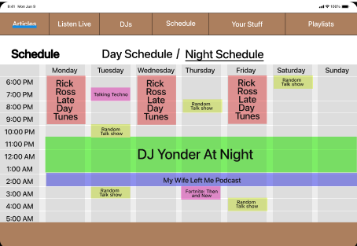

# Design Manifesto

Over the course of the Fall 2025 semester, I have developed a design philosophy grounded in user-centered thinking and decision making based on evidence. Through multiple UX projects ranging from a mobile app design to web interfaces and data visualization, I learned that effective design is not defined by only being pleasant visually, but by how well design decisions are informed by users, context, and constraints.

This manifesto outlines those key principles that help define my design process. These principles can be transferred to any new designing I will be doing and are supported by examples from my work.

---

## 1. The Design Process Shapes Better Decisions

One of the most significant things I discovered is that the quality of decisions is impacted by the design process. By dividing projects into research, ideation, prototyping, testing, and refinement, I was able to avoid making commitments to solutions that may not be ideal.

The Buffalo Zoo App Prototype narrowed its scope and eliminated unnecessary features by identifying user goals early on, such as navigation and visit planning. Analyzing the structure of the WSBU website before redesigning it in a prototype also uncovered usability problems that would not have been apparent without taking a step back and assessing the issue before making design decisions.

Iterative prototyping and earlier ideation of designs were the most beneficial aspects of this process. Time restraints and restricted access to actual users, however, occasionally limited the depth of testing throughout the class, which highlights the significance of critique and simulated user scenarios.

---

## 2. Iteration Is How Design Improves

Iteration turned out to be the most effective part of my workflow for every project. It was often only after the design was tested or visualized that problems with things like navigation or clarity became apparent.

 
For instance, earlier iterations of the WSBU Prototype had issues with navigation clarity and properly showing the content of the site. Layouts had to be made simpler and navigation had to be clearer after criticism and revision, which shows how important iteration is in the design process.

This procedure reaffirmed that initial designs are more like hypotheses rather than definitive solutions and that advancement in the design is achieved through iterative improvement.

---

## 3. Design Methods Change With Context

The design process differed depending on what I was designing. User testing and prototyping were more telling in  projects like the Buffalo Zoo App and WSBU Prototype, which are based entirely on user navigation and experience which could be evaluated directly.

In contrast, the NBA Shots Heat Chart required a different approach. 

Instead of testing interaction flows, the focus shifted to visual clarity and pattern recognition. Design decisions are evaluated based on how quickly and accurately users can interpret the data shown by the graph.

This contrast taught me that while the core UX principles will remain consistent across different projects, the methods used to evaluate how I go about designing must change with the designing context.

---

## 4. Visual Design Can Be a Core UX Tool

Throughout the semester, I learned that visual design choices like spacing, color, contrast, and layout have a direct impact on usability. Visual design actively changes how users end up understanding and interacting with information.

In the NBA Shots Heat Chart, small changes in color intensity and layout helped change how easily shot patterns could be identified. As people naturally view green as "good" and red as "bad", changing the color code in the visualization to reflect that view is a significant tool that makes the design easier to interpret

These experiences reinforced that effective UX can depend on intentional visual decisions that support clarity and accessibility.

---

## 5. Expectations Rarely Match Reality

Many of my initial expectations were challenged once designs were tested or reviewed, or even designed in the first place. Features I assumed would be intuitive or easy to develop often required revision, while simpler solutions proved more effective.

In the Buffalo Zoo App, things like navigation needed to be rethought after evaluating how users might interact with the app in the real world. Also, fitting all the information we wanted to fit in the design of the app proved to be more difficult than intended. These moments show the importance of testing assumptions early and being flexible throughout the design process.

Learning to view unexpected outcomes as opportunities rather than failures became an important part of my growth as a designer.

---

## Conclusion

These projects helped influenced a design philosophy that prioritizes flexibility, clarity, and decision-making based on evidence. My approach puts a strong emphasis on comprehending users, purposefully iterating my designs, and changing techniques according to the situation. These ideas serve as a basis that I can apply to new designing situations outside of this course.
